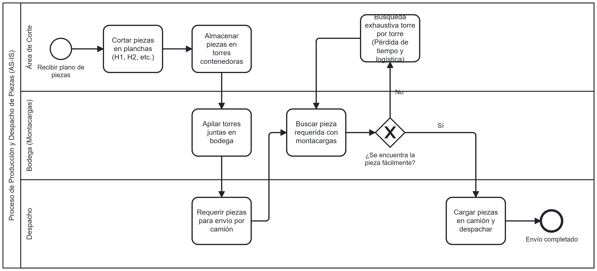

# Proceso de negocio — AS-IS
 
## Macro-proceso y proceso específico
Logística y Producción → Almacenamiento y Despacho de Piezas
 
## Objetivo de negocio del proceso
Producir, organizar en bodega y cargar correctamente las piezas solicitadas en los camiones para su despacho.
 
## Participantes y sus objetivos
| Participante | Objetivo en el proceso |
|---------------|------------------------|
| Área de Corte | Cortar las piezas según los planos y agruparlas en las torres contenedoras. |
| Bodega (Montacargas) | Almacenar las torres apiladas y localizar las piezas exactas cuando se requieren. |
| Despacho | Solicitar las piezas necesarias y cargar el camión para completar el envío. |
 
## Diagrama AS-IS

 
Archivo fuente: [`./diagramas/as-is.bpmn`](diagramas/As_is_1.xml)

Nota: distingan tareas de usuario, de servicio y manuales con el marcador correspondiente.
 
## Problemas identificados
- La búsqueda de piezas es manual y exhaustiva (torre por torre), lo que impide al operario de bodega localizar el material rápidamente y retrasa todo el proceso.
- Pérdida significativa de tiempo productivo y aumento del gasto logístico al mantener los camiones en espera durante las búsquedas.
