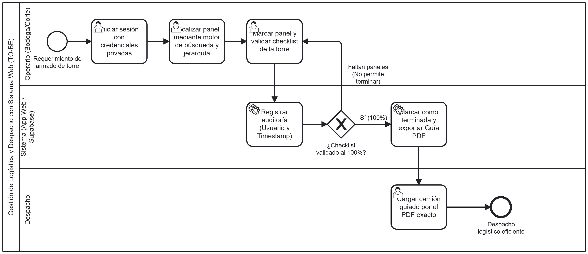

# Análisis de rediseño y propuesta TO-BE
 
## Mejoras identificadas por participante
| Participante | Objetivo | Problema | Mejora deseada |
|----------------|----------|----------|-----------------|
| Operario (Bodega) | Encontrar y organizar las piezas rápidamente para su carga | Búsqueda manual y exhaustiva (torre por torre) que genera importantes retrasos logísticos | Implementación de un sistema digital con motor de búsqueda exacto y validación de piezas mediante checklist |
 
## Iniciativas de rediseño
### Iniciativa 1
- Actividad(es) del AS-IS que afecta: Buscar pieza requerida con montacargas y Búsqueda exhaustiva torre por torre (Actor: Operario de Bodega).
- Heurística aplicada: Automatización e integración de sistema de información.
- Objetivo o mejora que resuelve: Eliminar la búsqueda a ciegas mediante un buscador jerárquico (Proyectos > Torres > Paneles) y un control estricto que exige el 100% de la validación.
- Efecto esperado (tiempo/costo/calidad/flexibilidad): Reducción drástica del tiempo de búsqueda y costos logísticos por esperas; aumento en la calidad y seguridad del despacho gracias a la auditoría automática y la generación del PDF.
 
## Diagrama TO-BE

 
Archivo fuente: [`./diagramas/to-be.bpmn`](diagramas/To_be.xml)
 
Nota: distingan tareas de usuario, de servicio y manuales con el marcador correspondiente.
 
## Actividades que cambian del AS-IS al TO-BE
| Actividad en el AS-IS | Actividad en el TO-BE | Qué cambia |
|-------------------------|--------------------------|------------|
| Buscar pieza exhaustivamente torre por torre. | Localizar panel mediante motor de búsqueda y jerarquía. | Se pasa de una búsqueda física manual basada en ensayo y error a una localización digital exacta. |
| Requerir piezas para envío por camión. | Marcar como terminada y exportar Guía PDF (tras validar checklist al 100%). | La recolección manual se reemplaza por una validación sistémica que audita al usuario y genera automáticamente el documento final de despacho. | 

Esta tabla es la que usarán en 03-requisitos.md y 04-historias-usuario.md para asociar cada requisito e historia a la actividad que cambia.
