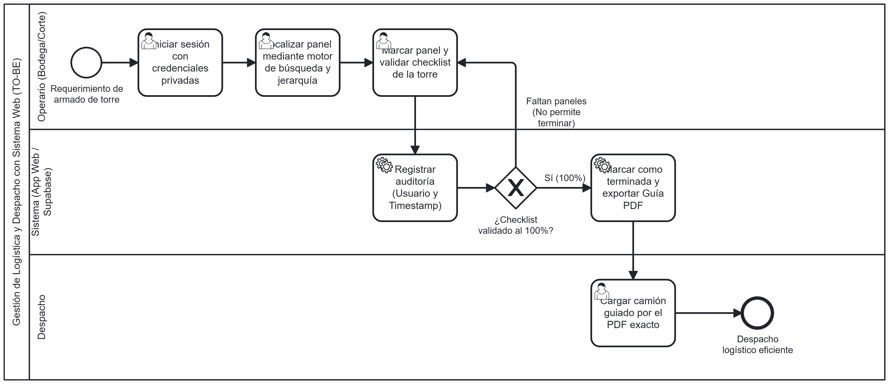

# Análisis de rediseño y propuesta TO-BE
 
## Mejoras identificadas por participante
| Participante | Objetivo | Problema | Mejora deseada |
|----------------|----------|----------|-----------------|
| Jefe de Operaciones | Gestionar los proyectos y sus piezas. | Dificultad en la gestión, errores en el desarrollo y falta de visibilidad. | Poder visualizar y filtrar proyectos, listados completos de piezas y torres asociadas. |
| Trabajador | Asegurar que todas las piezas estén listas para la siguiente etapa del proyecto. | Falta de evidencia e incertidumbre sobre si faltan paneles en las torres. | Uso de un checklist con estados visuales (listo/no listo), marca de tiempo y adjunto de fotografías. |
| Dueño de la empresa | Restringir acciones a personal autorizado. | Acceso global sin control de quién realiza qué acción. | Sistema de autenticación con división de roles (Administrador y operario). |
 
## Iniciativas de rediseño
### Iniciativa 1
- Actividad(es) del AS-IS que afecta: Buscar pieza requerida con montacargas y Búsqueda exhaustiva torre por torre.
- Heurística aplicada: Automatización, control de accesos e integración de validación digital.
- Objetivo o mejora que resuelve: Eliminar búsquedas a ciegas y errores de armado mediante filtrado digital, validación por checklist e identificación de usuarios.
- Efecto esperado (tiempo/costo/calidad/flexibilidad): Reducción de tiempos de búsqueda (tiempo/costo), aumento de seguridad en la información (calidad) y trazabilidad completa del armado en terreno.
 
## Diagrama TO-BE

 
Archivo fuente: [`./diagramas/to-be.bpmn`](diagramas/To_be.xml)
 
Nota: distingan tareas de usuario, de servicio y manuales con el marcador correspondiente.
 
## Actividades que cambian del AS-IS al TO-BE
| Actividad en el AS-IS | Actividad en el TO-BE | Qué cambia |
|-------------------------|--------------------------|------------|
| (Acceso físico sin registro) | Inicio de sesión y autenticación de usuario | Se agrega una capa de seguridad con correo y contraseña para restringir vistas y permisos según rol (Administrador vs. Operario). |
| Buscar pieza requerida con montacargas | Monitoreo y Control de piezas del proyecto | La búsqueda física cambia a una interfaz web donde el sistema despliega, filtra y localiza las piezas exactas y su torre correspondiente. |
| Búsqueda exhaustiva torre por torre | Verificación y armado de torres en terreno | Se reemplaza el conteo manual por un checklist digital con indicadores visuales, marca de fecha/hora y respaldo fotográfico. |
