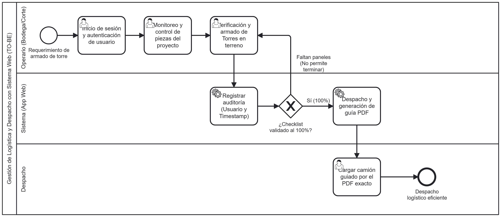

# Análisis de rediseño y propuesta TO-BE
 
## Mejoras identificadas por participante
| Participante | Objetivo | Problema | Mejora deseada |
|----------------|----------|----------|-----------------|
| Jefe de Operaciones | Gestionar los proyectos y sus piezas. | Dificultad en la gestión, errores en el desarrollo y falta de visibilidad. | Poder visualizar y filtrar proyectos, listados completos de piezas y torres asociadas. |
| Trabajador | Asegurar que todas las piezas estén listas para la siguiente etapa del proyecto. | Falta de evidencia e incertidumbre sobre si faltan paneles en las torres. | Uso de un checklist con estados visuales (listo/no listo), marca de tiempo y adjunto de fotografías. |
| Dueño de la empresa | Restringir acciones a personal autorizado. | Acceso global sin control de quién realiza qué acción. | Sistema de autenticación con división de roles (Administrador y operario). |
 
## Iniciativas de rediseño
### Iniciativa 1
- Actividad(es) del AS-IS que afecta: Buscar pieza requerida con montacargas y Búsqueda exhaustiva torre por torre.
- Heurística aplicada: Automatización, control de accesos e integración de validación digital.
- Objetivo o mejora que resuelve: Eliminar búsquedas a ciegas y errores de armado mediante filtrado digital, validación por checklist e identificación de usuarios.
- Efecto esperado (tiempo/costo/calidad/flexibilidad): Reducción de tiempos de búsqueda (tiempo/costo), aumento de seguridad en la información (calidad) y trazabilidad completa del armado en terreno.
 
## Diagrama TO-BE

 
Archivo fuente: [`./diagramas/to-be.bpmn`](diagramas/To_be.xml)
 
 
## Actividades que cambian del AS-IS al TO-BE
| ID AS-IS | Actividad en el AS-IS | ID TO-BE | Actividad en el TO-BE | Qué cambia |
|:---|:---|:---|:---|:---|
| [ACT-AS-01](./01-proceso-as-is.md#act-as-01) | Acceso físico sin registro ni autenticación | [ACT-TOBE-01](#act-tobe-01) | Inicio de sesión y autenticación de usuario | Se agrega una capa de seguridad con correo y contraseña para restringir vistas y permisos según rol (Administrador vs. Operario). |
| [ACT-AS-02](./01-proceso-as-is.md#act-as-02) | Buscar pieza requerida con montacargas | [ACT-TOBE-02](#act-tobe-02) | Monitoreo y control de piezas del proyecto | La búsqueda física cambia a una interfaz web donde el sistema despliega, filtra y localiza las piezas exactas y su torre correspondiente. |
| [ACT-AS-03](./01-proceso-as-is.md#act-as-03) | Búsqueda exhaustiva torre por torre | [ACT-TOBE-03](#act-tobe-03) | Verificación y armado de torres en terreno | Se reemplaza el conteo manual por un checklist digital con indicadores visuales, marca de fecha/hora y respaldo fotográfico. |
| [ACT-AS-04](./01-proceso-as-is.md#act-as-04) | Carga de camión y despacho manual | [ACT-TOBE-04](#act-tobe-04) | Despacho y generación de guía PDF | Se genera un documento oficial PDF con validación al 100% de la torre para respaldo de bodega y despacho exacto. |

## Actividades del proceso TO-BE (Elementos Trazables)

### ACT-TOBE-01 — Inicio de sesión y autenticación de usuario
Capa de seguridad de acceso mediante credenciales (correo y contraseña), diferenciando roles de Administrador y Operario con permisos acordes a su función.
- **Origen (AS-IS):** [ACT-AS-01](./01-proceso-as-is.md#act-as-01)
- **Requisitos asociados:** [RP-04](./03-requisitos.md#rp-04), [RP-08](./03-requisitos.md#rp-08)
- **Historia de usuario asociada:** [HU-03](./04-historias-usuario.md#hu-03)

### ACT-TOBE-02 — Monitoreo y control de piezas del proyecto
Interfaz web centralizada donde se despliegan y filtran los proyectos, torres y paneles en tiempo real, eliminando la necesidad de rastreo físico a ciegas en la bodega.
- **Origen (AS-IS):** [ACT-AS-02](./01-proceso-as-is.md#act-as-02)
- **Requisitos asociados:** [RP-01](./03-requisitos.md#rp-01), [RP-02](./03-requisitos.md#rp-02), [RP-03](./03-requisitos.md#rp-03)
- **Historia de usuario asociada:** [HU-01](./04-historias-usuario.md#hu-01)

### ACT-TOBE-03 — Verificación y armado de torres en terreno
Módulo de checklist interactivo con estados visuales (listo / no listo), registro de auditoría automática (usuario y marca de tiempo) y respaldo fotográfico por torre.
- **Origen (AS-IS):** [ACT-AS-03](./01-proceso-as-is.md#act-as-03)
- **Requisitos asociados:** [RP-05](./03-requisitos.md#rp-05), [RP-06](./03-requisitos.md#rp-06), [RP-09](./03-requisitos.md#rp-09)
- **Historia de usuario asociada:** [HU-02](./04-historias-usuario.md#hu-02)

### ACT-TOBE-04 — Despacho y generación de guía PDF
Módulo de validación final y emisión de la Guía de Despacho en PDF. El sistema valida que el checklist esté completado al 100% antes de autorizar y registrar la salida del material.
- **Origen (AS-IS):** [ACT-AS-04](./01-proceso-as-is.md#act-as-04)
- **Requisitos asociados:** [RP-07](./03-requisitos.md#rp-07), Requisito derivado
- **Historia de usuario asociada:** [HU-04](./04-historias-usuario.md#hu-04)

